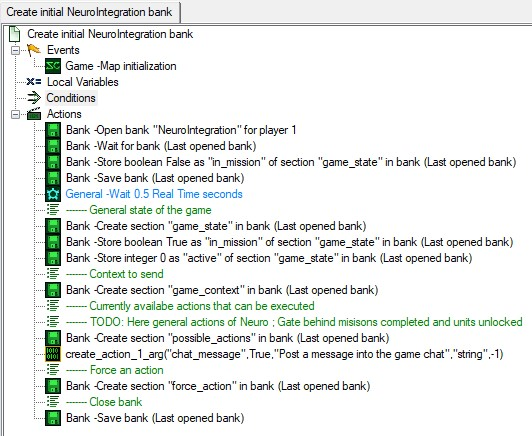

# SC2 Neuro API Integration Documentation
## How the integration works
StarCraft 2 is able to read and write to bank files to share information over multiple maps, like during a campaign. The structure of these bank files is in XML format.

Both the game and the integration communicate over this file with timed read and write windows to avoid read/write conflicts. (This was actually one of the hardest problems to solve) When a map is loaded the game periodically checks the NeuroIntegration.SC2Bank file and when specific values are found they trigger certain effects in-game. 

The job of the integration is to convert values in the bank file into messages to Neuro and vice versa.

The integration recognises when a mission is active, if the game is currently in an intermission, when the game is paused and when the game is blocking commands to be written to the bank file. When the game is paused or blocking, the sent action commands will get added to a queue to be written to the file when unpaused/unblocked. Max queue size is 3 action commands, new commands will remove older commands.

The integration searches and works with the bank file named NeuroIntegration.SC2Bank.

## Structure of the .SC2Mod file
All .SC2Map files that use the Neuro API integration have a dependency to a .SC2Mod file.

This file contains:
- Triggers shared by all maps to make the integration work
- Templates to create action commands, force action commands and context commands
- Global variable to control when the game can write to the bank file

### Create initital NeuroIntegration bank

Creates the initial bank file at the start of a mission

- Set the "in_mission" value in the "game_state" section in the bank file to False. This is the signal for the integration to set every bool in the bank file to False to guarantee everything is reset
- Set "in_mission" to True, this is the signal for the integration that the mission started
- Initialise the "active" value. This will increment periodically to check if the game is paused or not and to synchronise write times with the integration
- Create the "chat_message" action command for Neuro. This lets Neuro send a string to the bank file and cause an effect in the game when it is read

### Clean NeuroIntegration bank

For any potential event that causes the mission to end, set "in_mission" to False. This is the signal for the integration that the mission ended and sets every bool in the bank file to False

### Disable Achievements/Cheats

Disable achievements and cheats at the start of a mission because this is a modded campaign which should not award in-game achievements.

### Block / Unblock Commands

These triggers can be used to block or unblock commands during sections where Neuro should not have an effect on the game, like during a cutscene.

### Player Chat Message Context

Everytime a player sends a message into chat, send a context command to Neuro.

### Create action command templates

These templates can be used to create or update action commands for Neuro. Use different templates depending how many arguments are needed.

- action_name: The name of the action command
- action_active: If True the action command gets created for Neuro, if False the action command gets removed (Register/Unregister action)
- action_description: Description for what the action command does for Neuro
- action_argument_x_type: The type the argument should have that Neuro will send (String, Float, Int, Bool)
- action_uses: The amount of times Neuro can send the action command. Useful for force actions. Negative action_uses means infinite uses.

### Create Force Action

This template is used to create a force action command for Neuro. Neuro is forced to use one action command. Only one force action should be active at any time.

- action_names: The name/s of the action/s that Neuro should choose from.
- state: The current state of the game as context for Neuro
- query: Message for Neuro for what she is supposed to be doing
- ephemeral_context: If False, the context provided in the state and query parameters will be remembered by Neuro after the actions force is completed. If True, Neuro will only remember it for the duration of the force action.
- priority: Determines how urgently Neuro should respond to the action force when she is speaking. If Neuro is not speaking, this setting has no effect. The default is "low", which will cause Neuro to wait until she finishes speaking before responding. "medium" causes her to finish her current utterance sooner. "high" prompts her to process the force action immediately, shortening her utterance and then responding. "critical" will interrupt her speech and make her respond at once. Use "critical" with caution, as it may lead to abrupt and potentially jarring interruptions.

### Create Context

This template is used to create a context command for Neuro.

- context_name: Name of the context message
- context: Context to send to Neuro
- silent: If True, the message will be added to Neuro's context without prompting her to respond to it. If False, Neuro might respond to the message directly, unless she is busy talking to someone else or to chat.

# Ideas for the future
- Just delete the bank file when in_mission == False instead of setting everything to False to reset (?, Permanent choices in another file)
- Implement a trigger that clears the action command queue. For example after unblocking to remove unwanted commands in the queue.

