# SC2 Neuro API Integration Documentation
## How the integration works
StarCraft 2 is able to read and write to bank files to share information over multiple maps, like during a campaign. The structure of these bank files is in XML format.

Both the game and the integration communicate over this file with timed read and write windows to avoid read/write conflicts (This was actually one of the hardest problems to solve). When a map is loaded the game periodically checks the NeuroIntegration.SC2Bank file and when specific values are found they trigger certain effects in-game. 

The job of the integration is to convert values in the bank file into messages to Neuro and vice versa.

The integration recognises when a mission is active, if the game is currently in an intermission, when the game is paused and when the game is blocking commands to be written to the bank file. When the game is paused or blocking, the sent action commands will get added to a queue to be written to the file when unpaused/unblocked. Max queue size is 3 action commands, new commands will remove older commands.

The integration searches and works with the bank file named "NeuroIntegration.SC2Bank".

The integration can be started at any time and works with saves and loads.

## Structure of the .SC2Mod file
All .SC2Map files that use the Neuro API integration have a dependency to a .SC2Mod file.

This file contains:
- Templates to create action commands, force action commands and context commands
- Triggers shared by all maps to make the integration work
- Global variable to control when the game can write to the bank file

Templates in .SC2Mod file

  
### Create action command templates
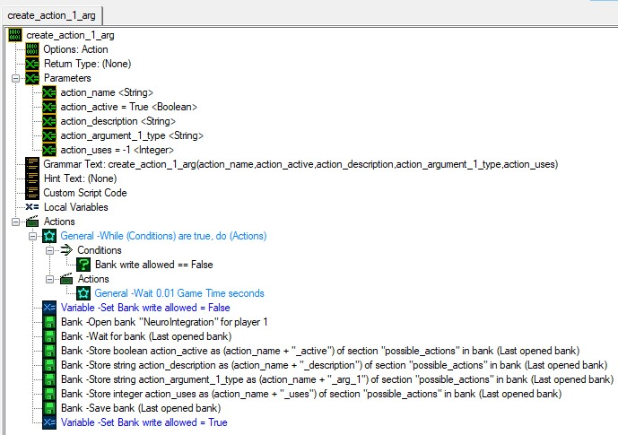

These templates can be used to create or update action commands for Neuro. Use different templates depending how many arguments are needed.

- action_name: The name of the action command
- action_active: If True the action command gets created for Neuro, if False the action command gets removed (Register/Unregister action)
- action_description: Description for what the action command does for Neuro
- action_argument_x_type: The type the argument should have that Neuro will send. Possible types are:
  - string, int, float, bool
  - int(&lt;int&gt;, &lt;int&gt;) or float(&lt;float&gt;, &lt;float&gt;) for a type int or float in a range
  - str(&lt;str&gt;, ..., &lt;str&gt;) for a type string in a given list
  - string/regex=&lt;pattern&gt; for a type string with a given regex pattern (Example: string/regex=^[a-z0-9_-]{3,16}$)
- action_uses: The amount of times Neuro can send the action command. Useful for force actions. Negative action_uses means infinite uses.

### Create Force Action
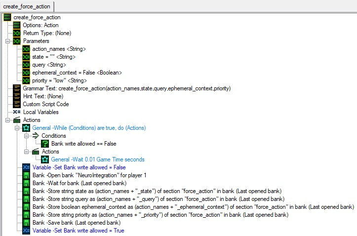

This template is used to create a force action command for Neuro. Neuro is forced to use one action command. Only one force action should be active at any time. If the integration detects multiple active force actions Neuro will only receive one and can only receive another after one of the actions from the action force is executed.

- action_names: The name/s of the action/s that Neuro should choose from
- state: The current state of the game as context for Neuro
- query: Message for Neuro for what she is supposed to be doing
- ephemeral_context: If False, the context provided in the state and query parameters will be remembered by Neuro after the actions force is completed. If True, Neuro will only remember it for the duration of the force action.
- priority: Determines how urgently Neuro should respond to the action force when she is speaking. If Neuro is not speaking, this setting has no effect. The default is "low", which will cause Neuro to wait until she finishes speaking before responding. "medium" causes her to finish her current utterance sooner. "high" prompts her to process the force action immediately, shortening her utterance and then responding. "critical" will interrupt her speech and make her respond at once. Use "critical" with caution, as it may lead to abrupt and potentially jarring interruptions.

### Create Context
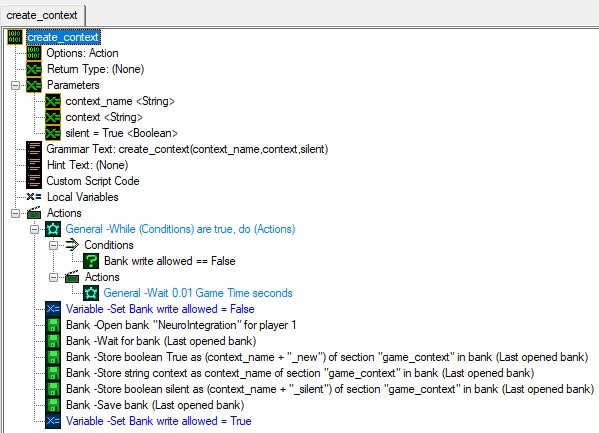

This template is used to create a context command for Neuro.

- context_name: Name of the context message
- context: Context to send to Neuro
- silent: If True, the message will be added to Neuro's context without prompting her to respond to it. If False, Neuro might respond to the message directly, unless she is busy talking to someone else or to chat.

Triggers in .SC2Mod file

### Create NeuroIntegration Bank
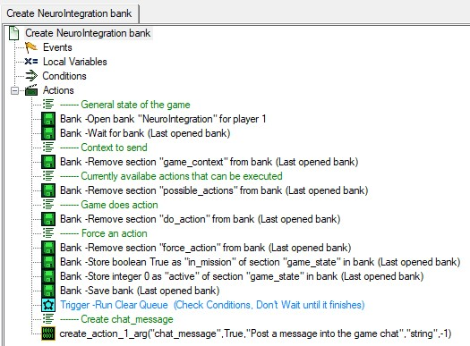

Cleans up and initialises the bank file at the start of a mission.

- Remove all sections but the "game_state" section
- Set "in_mission" to True, this is the signal for the integration that the mission started
- Initialise the "active" value. This will increment periodically to check if the game is paused or not and to synchronise write times with the integration
- Call the "Clear Queue" trigger that leads to the Neuro action command queue to be cleared (This is for cases where for some reason the mission is started with in_mission already true and Neuro could have sent commands before the mission has started)
- Create the "chat_message" action command for Neuro. This lets Neuro send a string to the bank file and cause an effect in the game when it is read

### Clean NeuroIntegration bank
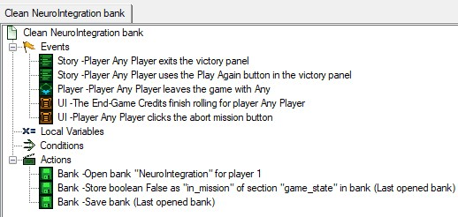

Cleans up the bank file and sets "in_mission" to False, this is the signal for the integration that the mission ended.

For some reason the game has problems writing to the bank file when the mission closes which leads to different outcomes for the bank file:
- This works as intended and all but the "game_state" section is removed and "in_mission" = False
- The bank file is deleted and then only the entry "in_mission" = False is created
- The bank file is empty / doesn't exist anymore

The integration can deal with all these cases. I don't know why this is so inconsistent

### Disable Achievements/Cheats
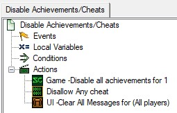

Disable achievements at the start of a mission because this is a modded campaign which should not award in-game achievements.

### Block / Unblock Commands
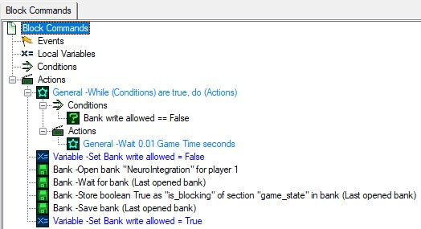

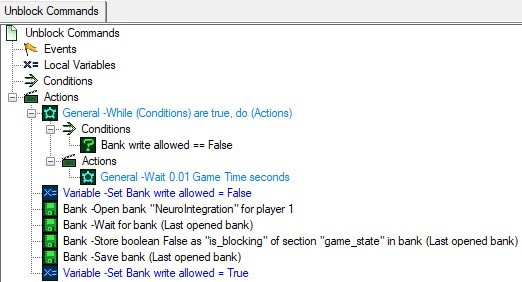

This trigger/function can be used to block or unblock commands during sections where Neuro should not have an effect on the game, like during a cutscene. 
When unblocking the action queue can also be optionally cleared.

### Clear Queue
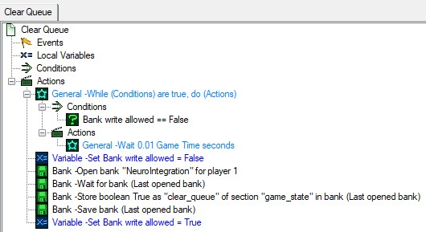

Clears the action queue. Useful after a Block Commands event.

### Player Chat Message Context
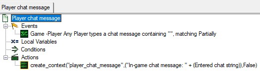

Everytime a player sends a message into chat, send a context command to Neuro.

## Structure of the .SC2Map files
All map-specific actions, force actions and contexts should be defined and handled in their respective .SC2Map file.

All .SC2Map files contain three important triggers:
- Event triggers that initialise and end the mission
- The execution loop where changes to the bank file are processed

Triggers in .SC2Map files

### Init Map
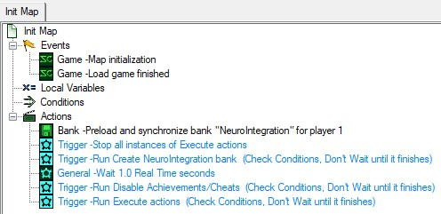

Initialises the map when the mission starts or when it is loaded

### Clean Up
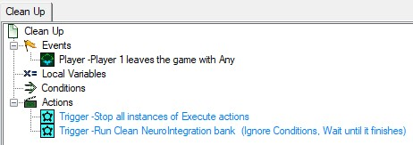

Player 1 leaves everytime when the mission ends in some form.

Cleans the bank file. This sometimes doesn't work as intended, see [CleanNeuroIntegrationBank](#Clean-NeuroIntegration-Bank).

### Execute Actions
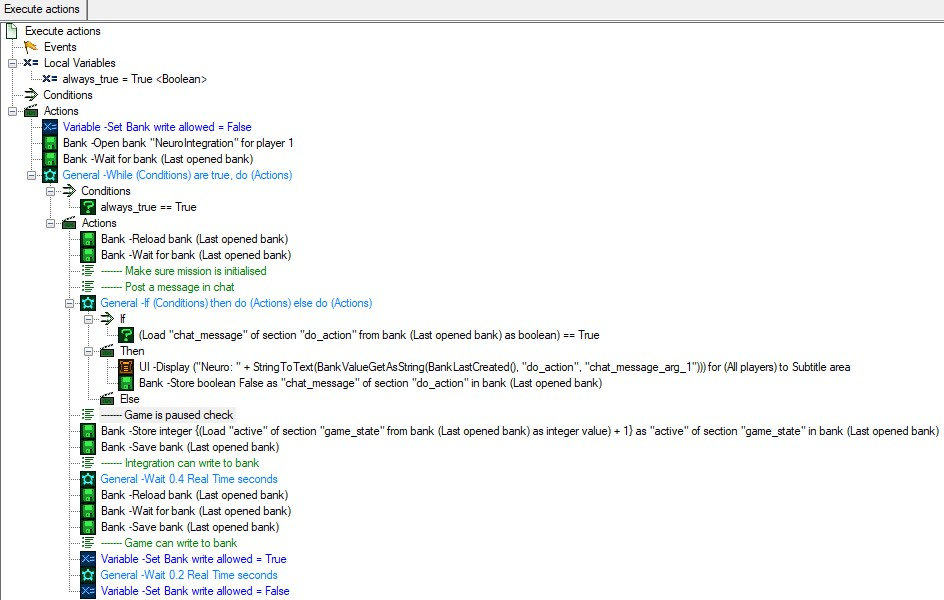

Periodically checks the "do_action" section for things to do. For every defined action for Neuro there must be a section in here to deal with the received commands from Neuro. For example like the chat_message action defined [here](#Create-NeuroIntegration-Bank).

Updates the "active" value, this is the signal for the integration that the game is not paused and also opens the write window for the integration to the bank file.

Finally open a window to let the game write to the bank file before repeating.

When the game is paused this loop will get frozen which leads to the "active" value not being updated and the integration noticing that the game is paused.

Note: Beware of the needed type for some functions in SC2. For example "chat_message_arg_1" first needs to be converted to a text to be displayed in a chat message.

## Example force action: "decide_raynor_max_health"
Example of a force action from the demo map.

Example force action

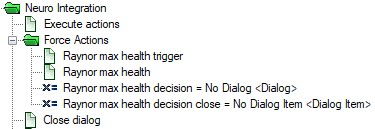

### Create the force action
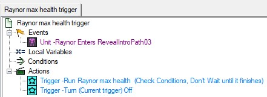

Prevent the trigger to be activated again.

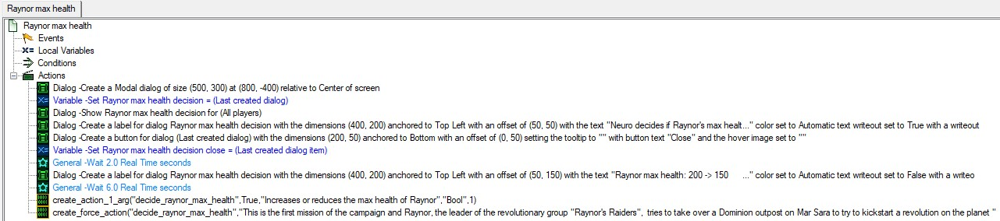
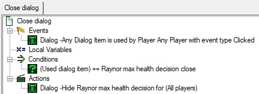

- First some info for the player, so they understand what the force action is about
- Create the "decide_raynor_max_health" action with only one use
- Create the force action with "decide_raynor_max_health"

### Handle the response
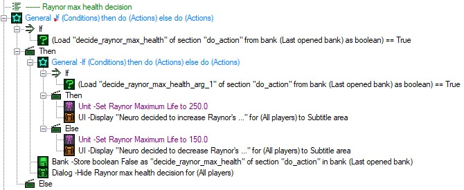

In the loop of the execute actions trigger handle the response from Neuro.

## Some notes
- Despite all efforts there might still be rare cases where the bank file is not in a state that it should be in, leading to unintended behaviour. Restarting the mission should reset everything
- A force action command will not be able to be executed if the game is saved and loaded after the start of a force action and before Neuro sends the corresponding action back
- When the game launches it will load the state of the NeuroIntegration bank file before it was shutdown, leading to the possibility that "in_mission" is true and actions being active while not in a mission. Because the "active" value does not get updated, the integration will recognise the mission as being paused. Neuro can send actions to a queue but they will never be actually executed. There is no way for the integration to differentiate between being paused in the menu screen or during a mission
