# SC2 Neuro API Integration Documentation
## How the integration works
StarCraft 2 is able to read and write to bank files to share information over multiple maps, like during a campaign. The structure of these bank files is in XML format.

Both the game and the integration communicate over this file with synchronised write windows to avoid write conflicts. When a map is loaded the game periodically checks the bank file and when specific values are found they trigger certain effects in-game. 

The job of the integration is to convert values in the bank file into messages to Neuro and vice versa.

The integration recognises when a mission is active, if the game is currently in an intermission, when the game is paused and when the game is blocking commands to be written to the bank file. When the game is paused or blocking, the sent action commands will get added to a queue to be written to the file when unpaused/unblocked. Max queue size is 3 action commands, new commands will remove older commands.

The integration searches and works with the bank file named "NeuroIntegration.SC2Bank" at ...\Documents\StarCraft II\Accounts\...\...\Banks.

The integration can be started at any time and even works with saves and loads.

## Structure of the integration in SC2
All .SC2Map files that use the Neuro API integration have a dependency to a .SC2Mod file. 

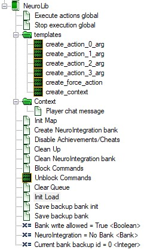
This .SC2Mod file contains:

 - Templates to create action commands, action force commands and context commands
 - Triggers shared by all maps to make the integration work, among others the global part of the execution loop
 - Global variables to coordinate writes from the game and the backup bank id to be used when the game is loaded

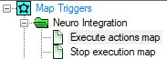
Every .SC2Map file that uses the integration must also contain:

- Local part of the execution loop

### Execution loop
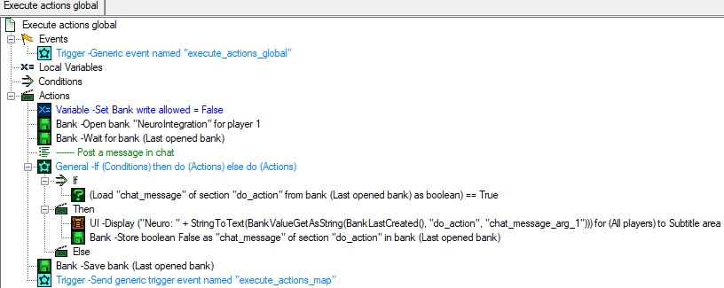

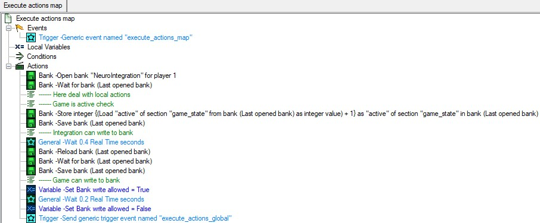

These two triggers periodically check the "do_action" section of the bank file for things to do. Once initiated they will endlessly ping-pong between each other.

Every action command that was defined needs a section in the execution loop to trigger effects when the game receives a command from Neuro. Actions defined on a global level in the global part of the execution loop and actions defined on a map level in the local part of the exection loop.

Step-by-step:
- Don't allow any events in the game to write to the bank file while the bank file is checked
- Deal with all actions defined on a global level
- Call the local part of the execution loop
- Deal with all actions defined on a local level
- Store the updated bank backup id that the integration wrote to the bank file. This id will be used by the game to load the correct bank backup when it is loaded
- Update the "active" value and save all changes made to the bank file. This is the signal for the integration that the game is not paused and also opens the write window for the integration to the bank file
- Save changes made to the bank file by the integration and open a write window for the game to write to the bank file before calling the global part of the execution loop and repeat

When the game is paused this loop will get frozen which leads to the "active" value not being updated and the integration noticing that the game is paused.

Note: Beware of the needed type for some functions in SC2. For example "chat_message_arg_1" first needs to be converted to a text to be displayed in a chat message.

### Create action command templates
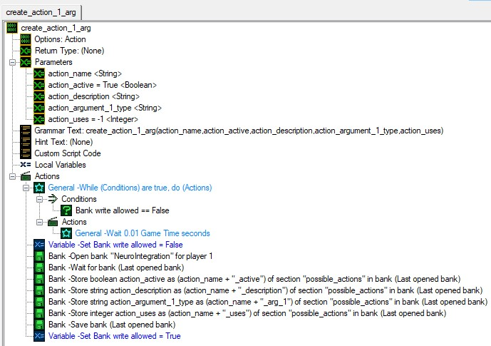

These templates can be used to create or update action commands for Neuro. Use different templates depending how many arguments are needed.

- action_name: The name of the action command
- action_active: If True the action command gets created for Neuro, if False the action command gets removed (Register/Unregister action)
- action_description: Description for what the action command does for Neuro
- action_argument_x_type: The type the argument should have that Neuro will send. Possible types are:
  - string, int, float, bool
  - int(&lt;int&gt;, &lt;int&gt;) or float(&lt;float&gt;, &lt;float&gt;) for a type int or float in a range
  - str(&lt;str&gt;, ..., &lt;str&gt;) for a type string in a given list
  - string/regex=&lt;pattern&gt; for a type string with a given regex pattern (Example: string/regex=^[a-z0-9_-]{3,16}$)
- action_uses: The amount of times Neuro can send the action command. Useful for abilities with limited uses. Negative action_uses means infinite uses. Can also be used for action forces but be careful to define the action and action force at the same time or the action might get used before the action force is active

### Create Force Action
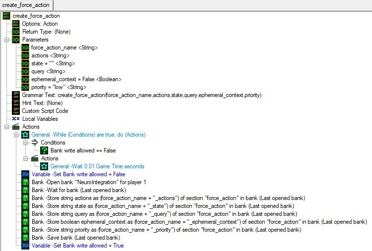

This template is used to create a force action command for Neuro. Neuro is forced to use one action command. Only one force action should be active at any time. If the integration detects multiple active force actions they will be added to a queue and Neuro will only receive one and can only receive another after one of the actions from the force action is executed.

- force_action_name: The name of this force action command
- action: The name/s of the action/s that Neuro should choose from, delimited by ",". The actions need to be active (Example: "action_1, action_2, action_3")
- state: The current state of the game as context for Neuro
- query: Message for Neuro for what she is supposed to be doing
- ephemeral_context: If False, the context provided in the state and query parameters will be remembered by Neuro after the actions force is completed. If True, Neuro will only remember it for the duration of the force action.
- priority: Determines how urgently Neuro should respond to the action force when she is speaking. If Neuro is not speaking, this setting has no effect. The default is "low", which will cause Neuro to wait until she finishes speaking before responding. "medium" causes her to finish her current utterance sooner. "high" prompts her to process the force action immediately, shortening her utterance and then responding. "critical" will interrupt her speech and make her respond at once. Use "critical" with caution, as it may lead to abrupt and potentially jarring interruptions.

### Create Context
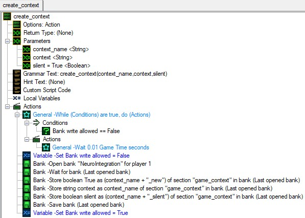

This template is used to create a context command for Neuro.

- context_name: The name of the context message
- context: Context to send to Neuro
- silent: If True, the message will be added to Neuro's context without prompting her to respond to it. If False, Neuro might respond to the message directly, unless she is busy talking to someone else or to chat.

***

### Example force action: "decide_raynor_max_health"
Example of a force action from the demo map.

Example force action

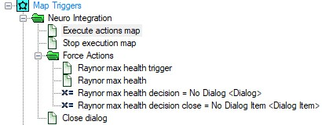

### Create the force action
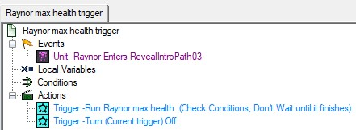

Prevent the trigger to be activated again.

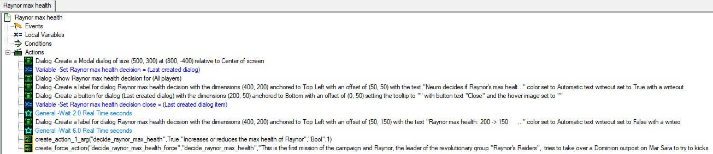

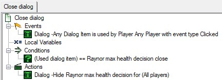

- First some info for the player, so they understand what the force action is about
- Create the "decide_raynor_max_health" action with only one use
- Create the force action with "decide_raynor_max_health"

### Handle the response
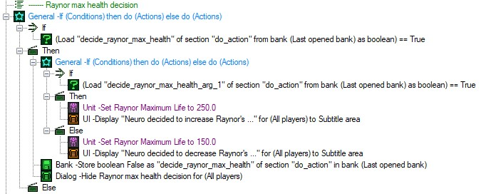

In the local execution loop handle the response from Neuro.

***

### Block / Unblock Commands
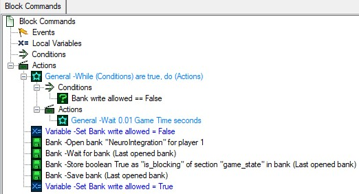

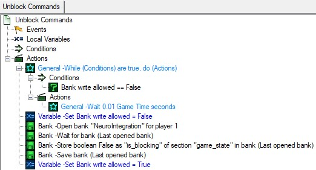

This trigger/function can be used to block or unblock commands during sections where Neuro should not have an effect on the game, like during a cutscene. 
When unblocking the action queue can also be optionally cleared.

### Clear Queue
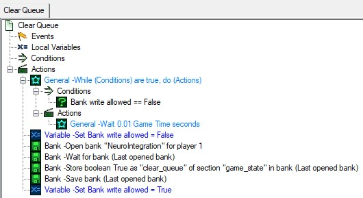

Clear the action queue. Useful after a Block Commands section.

## Other triggers
These triggers are necessary for the functionality of the integration and work in the background. They don't need to be used or called.

Background triggers

### Init Map
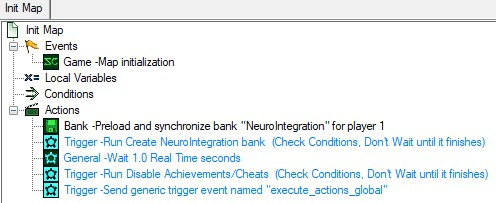

Initialises the NeuroIntegration bank file and start the execution loop when a map is started

### Create NeuroIntegration Bank
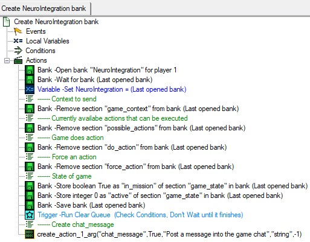

Clean up and initialise the bank file at the start of a mission.

- Remove all sections but the "game_state" section
- Set "in_mission" to True, this is the signal for the integration that the mission started
- Initialise the "active" value. This will increment periodically to check if the game is paused or not and to synchronise write times with the integration
- Call the "Clear Queue" trigger that leads to the Neuro action command queue to be cleared (This is for cases where for some reason the mission is started with in_mission already true and Neuro could have sent commands before the mission has started)
- Create the "chat_message" action command for Neuro. This lets Neuro send a string to the bank file and cause an effect in the game when it is read

### Disable Achievements/Cheats
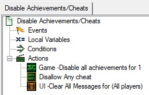

Disable achievements at the start of a mission because this is a modded campaign which should not award in-game achievements.

### Clean NeuroIntegration bank
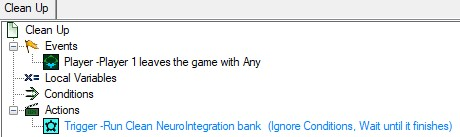

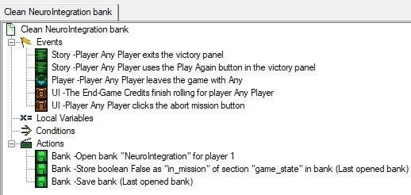

Clean up the bank file and set "in_mission" to False, this is the signal for the integration that the mission ended.

The game has problems writing to the bank file when the mission closes which leads to different outcomes for the bank file:
- This works as intended and all but the "game_state" section is removed and "in_mission" = False
- The bank file is deleted and then only the entry "in_mission" = False is created
- The bank file is empty / doesn't exist anymore

The integration can deal with all these cases.

### Stop Execution
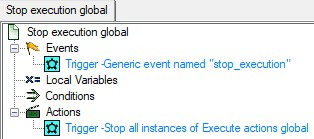
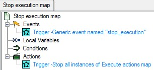

Stop the global and local execution loop.

### Save Backup
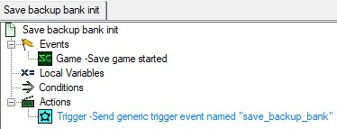
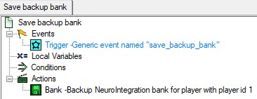

Create a backup of the current bank file before the game is saved. The integration will rename the backup file with the correct backup id to be used when the game is loaded.

### Init Load
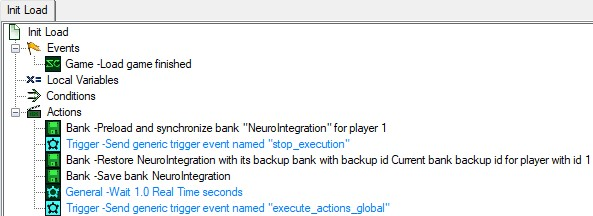

Restore the bank file to the state it was when the save was created and restart the execution loop.

### Player Chat Message Context
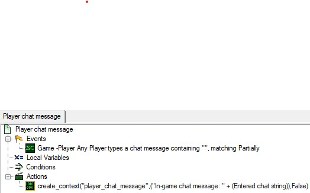

Everytime a player sends a message into chat, send a context command to Neuro.

## Some notes
- Despite all efforts there might still be rare cases where the bank file or the backup bank file is not in a state that it should be in, leading to unintended behaviour. Restarting the mission should reset everything
- An edge case is where a force action is active and then a save is loaded. When loading the integration will deregister all actions from Neuro but it is not clear if this will also remove a force action associated with a deregistered action. If not, upon loading this will lead to a force action being active with possibly no action to use and if the loaded game also has an active force action then this will cause Neuro to have two force actions at the same time
- When the game launches it will load the state of the NeuroIntegration bank file before it was shutdown, leading to the possibility that "in_mission" is true and actions being active while not in a mission. Because the "active" value does not get updated, the integration will recognise the mission as being paused. Neuro can send actions to a queue but they will never be actually executed. There is no way for the integration to differentiate between being paused in the menu screen or during a mission
